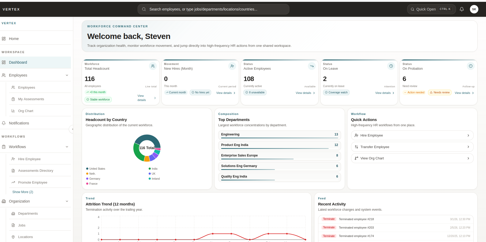

# Claude Code Enterprise Training Lab

This repository contains a 2-day hands-on workshop for mastering Claude Code in enterprise development environments.
Here is the screen shot of the App so you know you are working in a enviroment that is build enterprise grade.

## Repository Structure

- **main branch** - All workshop materials: labs, source code, frontend, database, scripts, and configs

## Getting Started

### For Students

1. Clone this repository:
   ```bash
   git clone https://github.com/ssthakuraa/claude-code-workshop.git
   cd claude-code-workshop
   ```

2. Follow the environment setup guide in `envsetup-student.md`

3. Begin with Lab 1: `labs/lab-01-claudemd.md`

### For Instructors

- Presentation decks: `decks/`
- Instructor flow guide: `instructor/flow-guide.md`
- Lab exercises: `labs/`

## Workshop Overview

This 4-day workshop teaches enterprise-grade Claude Code usage through hands-on labs:

**Day 1 - Foundation**: CLAUDE.md, Plan Mode, Skills & Commands, Context Management
**Day 2 - Productivity**: Hooks, Subagents, Parallel Sessions & Git Worktrees, Verification Loops
**Day 3 - Integration**: Playwright MCP, MySQL MCP
**Day 4 - Mastery**: CI/CD & Permissions, Capstone Project

Each lab builds on the previous ones, progressively teaching Claude Code features while building an HR Enterprise Platform (Spring Boot + React).

## Three Core Truths

1. Context management is the #1 constraint
2. Planning before implementation is non-negotiable
3. Simplicity beats complexity

## License

See individual files for licensing information.
