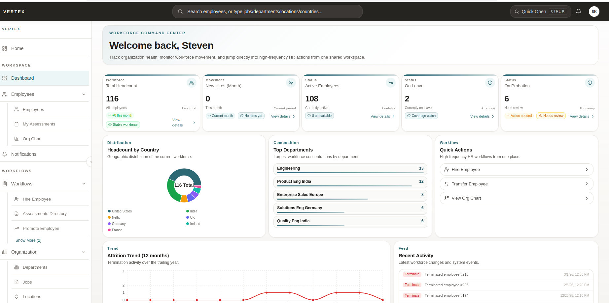

# Claude Code Enterprise Training Lab

2-day hands-on Claude Code enterprise workshop. Real full-stack app. 13 labs, free, fork it for your team.



## What's New in v1.2

- **New:** Lab 06 — Bad-Agent Recovery (catching and correcting agent drift)
- **Expanded:** Lab 05 — Hooks (all six lifecycle events)
- Phase-gate discipline, review-assist artifacts, JFR + HAR audit added throughout

See [v1.2 release notes](https://github.com/ssthakuraa/claude-code-workshop/releases/tag/v1.2) for full details.

## Workshop Overview

**Day 1 — Foundation & Productivity** (Labs 01–09)
- Lab 01: CLAUDE.md — Your Enterprise Constitution
- Lab 02: Planning Discipline — Think Before You Build
- Lab 03: Skills & Reusable Workflows — Repo Skills
- Lab 04: Context Management — The #1 Performance Lever
- Lab 05: Hooks — Structural Guardrails
- Lab 06: Bad-Agent Recovery — Catching and Correcting Drift
- Lab 07: Delegated Review — Fresh Context Beats Self-Review
- Lab 08: Parallel Sessions & Isolated Workspaces
- Lab 09: Verification Loops — The Quality Multiplier

**Day 2 — Integration & Governance** (Labs 10–13)
- Lab 10: MCP Servers — Playwright & Browser Verification
- Lab 11: Data Verification — Runtime Data Checks
- Lab 12: Enterprise Governance — Rollout Readiness, Safety Posture & Evidence
- Lab 13: Release-Style Feature Slice

## Three Core Truths

1. Context management is the #1 constraint
2. Planning before implementation is non-negotiable
3. Simplicity beats complexity

## Getting Started

```bash
git clone https://github.com/ssthakuraa/claude-code-workshop.git
cd claude-code-workshop
```

- **Setup:** see `lab-materials/claudelabsetup.md`
- **Begin with:** `lab-materials/claudelab01.md`
- **Companion overview deck:** `talks/claude-code-workshop-overview.pptx` (if present)

---

MIT-spirit. Fork for your team. Feedback welcome.
