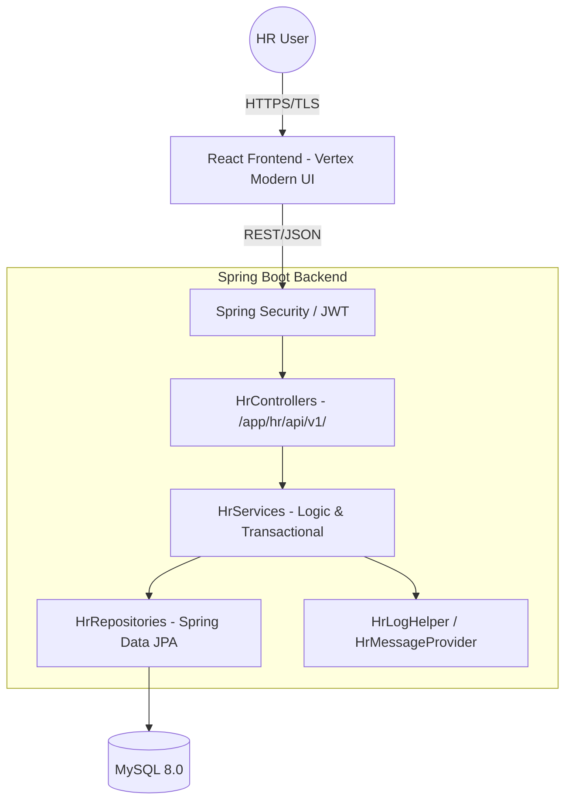
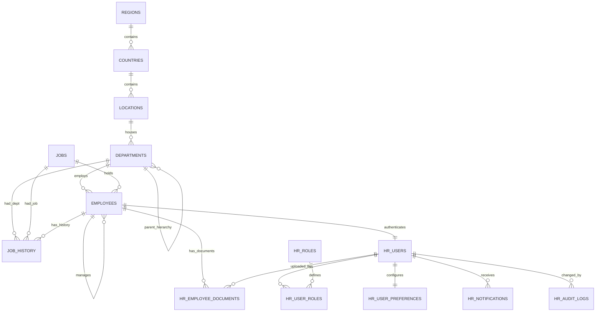

# HR Management System — Requirements Document

## 1. Executive Summary

This document defines the complete functional and technical requirements for the **Enterprise HR Management System** built with **Spring Boot + React**. The system manages the full employee lifecycle — from onboarding to offboarding — within a global, localized, and secure environment.

The application covers 7 core HR entities (Regions, Countries, Locations, Departments, Jobs, Employees, Job History) and is designed as an **Enterprise Platform** with the following architectural mandates:

- **Standards Adherence:** Strict naming conventions (prefix `Hr`) and logging patterns (`HrLogHelper`).
- **RBAC Security:** Granular role-based access control and session management via Spring Security.
- **API-First Design:** Versioned endpoints (`/app/hr/api/v1/`) documented via OpenAPI/Swagger.
- **Global Readiness:** Full NLS/MLS support with user-managed regional preferences.
- **Component-Driven UI:** Vertex Tech Modern Design System with reusable atomic components before screen implementation.

---

## 2. System Architecture

The application follows a **Decoupled Three-Tier Architecture**:

- **Client Layer:** React SPA utilizing Vertex Tech Modern Design System.
- **API Layer:** Spring Boot 3.2 RESTful Web Services (Java 21).
- **Data Layer:** MySQL 8.0 (InnoDB, `utf8mb4` character encoding).



---

## 3. Technology Stack

| Layer | Technology |
|---|---|
| **Backend Framework** | Spring Boot 3.2 REST Services |
| **Language** | Java 21 |
| **Database** | MySQL 8.x (InnoDB, utf8mb4) |
| **Auth** | Spring Security + JWT (Nimbus JOSE, HS256) with RBAC/ABAC enforcement |
| **Password Hashing** | Argon2id (BouncyCastle) |
| **Frontend Framework** | React 18+ with TypeScript |
| **Design System** | Vertex Tech Modern Design System — design tokens and patterns from Figma toolkit |
| **Styling** | Tailwind CSS with Modern Design System design tokens (colors, spacing 8px grid, typography, elevation) |
| **Frontend Routing** | React Router |
| **State / Data Fetching** | TanStack Query (React Query) for server state; React Context for auth and user preferences |
| **API Client** | Axios with a centralized `HrApiClient` wrapper (interceptors for JWT, error handling, base URL) |
| **Charts** | Recharts |
| **Forms** | React Hook Form |
| **Icons** | Lucide React |
| **Drag & Drop** | react-dnd (dashboard personalization, kanban board) |
| **API Style** | REST (JSON), versioned (`/app/hr/api/v1/...`) |
| **i18n** | Backend: Java ResourceBundle; Frontend: i18next with translation bundles |
| **Frontend Testing** | Vitest + React Testing Library (component); Cypress (E2E) |
| **Backend Testing** | JUnit 5 + Mockito (unit); Spring Boot Test (integration) |
| **Figma** | Modern Design toolkit for wireframes, mockups, and component reference |
| **Build** | Maven multi-module (`hrapp-common` framework, `hrapp-service` domain) |
| **Migration** | Flyway |
| **Mapping** | MapStruct |
| **Caching** | Caffeine (in-memory) for session data and frequently accessed metadata |

---

## 4. Traceability Matrix

| Source | Category | Design / Code Requirement |
|---|---|---|
| standards.md | Naming | All Java classes/interfaces must use the `Hr` prefix (e.g., `HrEmployeeController`). |
| standards.md | Logging | Every public method must log "Entry" and "Exit" via `HrLogHelper`. |
| schema.sql | Data Model | Implements core HR entities (Regions, Countries, Locations, Departments, Jobs, Employees, Job History) and their relationships. |
| Enterprise Req | Security | RBAC enforcement via Spring Security and JWT; no PII or passwords in logs. |
| Enterprise Req | API Pathing | All endpoints must follow the `/app/hr/api/v1/` format. |
| Enterprise Req | NLS/MLS | Support for multiple languages, timezones, and currency formats. |
| Enterprise Req | UI Design | Implementation of Atomic Design (Components -> Templates -> Screens) using Modern Design System. |
| Enterprise Req | Quality Gate | Mandatory code reviews at every stage and 80% JUnit/Cypress coverage. |

---

## 5. Functional Scope & Lifecycle Management

The system manages the following core HR business processes:

- **Employee Lifecycle:** Onboarding (Hire), Career Moves (Promotions/Transfers), Compensation Changes, and Offboarding (Terminations).
- **Organizational Management:** Maintaining the hierarchy of Regions, Countries, Locations, Departments, and Job Architectures.
- **Document Governance:** Managing digital assets related to employee records.
- **Reporting & Analytics:** Providing real-time insights into headcount, turnover, and compensation.

---

## 6. Data Model & Schema

### 6.1 Core HR Entities (from schema.sql)

The 7 core entities are:

1. **Regions** — geographic regions (e.g., Americas, Europe)
2. **Countries** — countries within regions
3. **Locations** — office/site addresses within countries
4. **Departments** — organizational units at specific locations
5. **Jobs** — job titles with salary ranges
6. **Employees** — staff records linked to departments and jobs
7. **Job History** — historical job/department assignments per employee

### 6.2 Extended ER Diagram



### 6.3 Schema Additions (Security, Preferences & Supporting)

| Table | Purpose |
|---|---|
| `hr_roles` | Defines system roles. Spring Security authority names: `ROLE_ADMIN`, `ROLE_HR_SPECIALIST`, `ROLE_MANAGER`, `ROLE_EMPLOYEE`. |
| `hr_users` | Stores authentication credentials (`username`, `password_hash`, `is_active`, `last_login`, `created_at`) linked to the Employee ID. |
| `hr_user_roles` | Many-to-Many mapping between users and roles. |
| `hr_user_preferences` | User-specific NLS settings (Language, Timezone, Date Format, Currency, Number Format). |
| `hr_audit_logs` | Audit trail: `table_name`, `record_id`, `action`, `old_value` (JSON), `new_value` (JSON), `changed_by`, `changed_at`. |
| `hr_employee_documents` | File metadata: `document_name`, `document_category`, `file_path`, `file_type`, `file_size_bytes`, `uploaded_by`, linked to Employee ID. |
| `hr_notifications` | User alerts: `notification_type`, `title`, `message`, `is_read`, `reference_table`, `reference_id`, linked to recipient User ID. |

### 6.4 Schema Extensions on Core Tables

The following columns are added via `ALTER TABLE` to the core entities:

**Employees — employment tracking & soft delete:**

| Column | Type | Details |
|---|---|---|
| `employment_status` | `ENUM('ACTIVE','ON_LEAVE','TERMINATED','PROBATION')` | Default `ACTIVE`. |
| `employment_type` | `ENUM('FULL_TIME','PART_TIME','CONTRACT','INTERN')` | Default `FULL_TIME`. |
| `contract_end_date` | `DATE` | Nullable. Tracked for fixed-term contracts to enable expiry alerts. |
| `deleted_at` | `TIMESTAMP` | Nullable. Soft delete marker. |

**Departments — hierarchy & soft delete:**

| Column | Type | Details |
|---|---|---|
| `parent_department_id` | `INT` | Nullable. Self-referencing FK for nested org hierarchy. |
| `deleted_at` | `TIMESTAMP` | Nullable. Soft delete marker. |

### 6.5 Data Integrity Rules

- **Soft Deletes:** Use `deleted_at` (TIMESTAMP, nullable) on `employees` and `departments`. All queries must filter `WHERE deleted_at IS NULL` by default.
- **Audit Logging:** All `UPDATE` and `DELETE` operations must be intercepted by a Spring JPA `@EntityListener` to populate `hr_audit_logs` automatically.
- **Character Encoding:** All tables use InnoDB with `utf8mb4` for full Unicode support.

---

## 7. Security & RBAC

### 7.1 Role Definitions & Permissions

| Role | Spring Authority | Functional Capabilities | Data Visibility |
|---|---|---|---|
| **System Admin** | `ROLE_ADMIN` | Application config, Role/Permission mapping, Audit trail review. | Global Access. |
| **HR Specialist** | `ROLE_HR_SPECIALIST` | Full lifecycle management (Hire to Retire), Salary updates, Org structure edits. | Global Access. |
| **Line Manager** | `ROLE_MANAGER` | Manager Self-Service (MSS): Initiate promotions/transfers for team, view team performance. | Direct and Indirect Reports only. |
| **Employee** | `ROLE_EMPLOYEE` | Employee Self-Service (ESS): Update personal info (address, bank details), view payslips/history. | Own profile; Public Directory. |

### 7.2 Detailed Permissions Matrix

| Feature | Admin | HR Specialist | Line Manager | Employee |
|---|---|---|---|---|
| Manage Users/Roles | Full | None | None | None |
| Global Employee Edit | Full | Full | None | None |
| Salary Viewing | Yes | Yes | Direct/Indirect Reports Only | Own Only |
| Hire / Terminate | Yes | Yes | None | None |
| Promote / Transfer | Yes | Yes | Team Only | None |
| Regional Preferences | Self | Self | Self | Self |
| Audit Log Viewing | Yes | None | None | None |

### 7.3 Sensitive Data Masking

- **Salary Masking:** If the caller's role is `ROLE_EMPLOYEE` and they are viewing another employee, the `salary` and `commission_pct` fields in the DTO must be set to `null` before returning.
- **PII Masking:** The system must support partial masking (e.g., masking `email` and `phone_number` to show only partial values) when data is viewed by users without sufficient privileges.
- **Log Privacy:** Never log `salary`, `email`, or `phoneNumber` values. Use `"MASKED"` or log the record ID only.

### 7.4 Session & Authentication

- **Login:** Username/password authentication with JWT token issuance. JWT payload contains `username` and `roles`.
- **Password Policy:** Minimum 8 characters, at least one uppercase, one lowercase, one digit, and one special character.
- **JWT Management:** Stateless session handling with configurable expiry (default 30 minutes). Token refresh flow for long-lived sessions.
- **Spring Security Integration:** Filter chain with JWT authentication filter, role-based method security (`@PreAuthorize`), and CORS configuration.
- **Security Utility:** A reusable `HrSecurityUtil` for role checks across the backend.
- **User Provisioning:** HR Specialist or Admin can create user accounts linked to employee records.
- **User Deactivation:** Admin can set `is_active = false` on `hr_users` to disable login without deleting the account. Deactivated users must be rejected at the JWT authentication filter.
- **Frontend Guarding:** React Protected Routes prevent unauthorized UI navigation. Axios interceptors handle 401/403 responses globally.

### 7.5 Security Headers

Configure in `HrSecurityConfig` Spring Security filter chain:

| Header | Value | Purpose |
|---|---|---|
| `Content-Security-Policy` | `default-src 'self'; script-src 'self'; style-src 'self' 'unsafe-inline'` | Prevent XSS via injected scripts. |
| `Strict-Transport-Security` | `max-age=31536000; includeSubDomains` | Force HTTPS. |
| `X-Content-Type-Options` | `nosniff` | Prevent MIME-type sniffing. |
| `X-Frame-Options` | `DENY` | Prevent clickjacking. |
| `Referrer-Policy` | `strict-origin-when-cross-origin` | Limit referrer leakage. |
| `Permissions-Policy` | `camera=(), microphone=(), geolocation=()` | Disable unnecessary browser APIs. |

### 7.6 OWASP Top 10 Mitigations

| Risk | Mitigation in This Project |
|---|---|
| **SQL Injection** | Spring Data JPA parameterized queries. NEVER concatenate strings into `@Query`. Use `Specification` API for dynamic queries. |
| **XSS** | React auto-escapes JSX. NEVER use `dangerouslySetInnerHTML`. Sanitize stored HTML with OWASP Java HTML Sanitizer. |
| **Broken Access Control** | Method-level `@PreAuthorize` on every sensitive endpoint. Row-level filtered queries (managers see only their reports). |
| **CSRF** | Not applicable — JWT Bearer tokens in Authorization header serve as proof of intent. |
| **Security Misconfiguration** | Security headers (Section 7.5), secrets externalized (Section 7.7), dependencies scanned (Section 7.8). |

### 7.7 Secrets Management

- **NEVER** commit secrets (database passwords, JWT signing keys, SMTP credentials) to Git.
- Use `.env` files (gitignored) for local development.
- Production: externalize via environment variables or a secrets manager (HashiCorp Vault, AWS Secrets Manager).
- Rotate database passwords and JWT signing keys on a 90-day schedule.

### 7.8 Dependency Vulnerability Scanning

- **Backend:** OWASP Dependency-Check Maven plugin in CI. Fail the build on HIGH/CRITICAL CVEs.
- **Frontend:** `npm audit` in CI pipeline.
- Automated PR creation (Dependabot or Snyk) when new vulnerabilities are discovered.

---

## 8. Backend Architecture

The backend must be built using reusable utility frameworks to minimize duplication and maximize consistency.

### 8.1 Package Structure

All class names must start with the `Hr` prefix.

```
com.company.hr
  ├── config          # HrSecurityConfig, HrWebConfig, HrCorsConfig
  ├── controller      # HrEmployeeController, HrJobController, etc.
  ├── service         # HrEmployeeService, HrAuditService, etc.
  ├── repository      # HrEmployeeRepository, etc.
  ├── model           # HrEmployee (Entity), HrUser, etc.
  ├── dto             # HrEmployeeDTO, HrPreferenceDTO, etc.
  ├── mapper          # HrEmployeeMapper (MapStruct interfaces)
  ├── exception       # HrGlobalExceptionHandler, HrNotFoundException, etc.
  └── util            # HrLogHelper, HrMessageProvider, HrSecurityUtil, HrFormatter
```

### 8.2 Strict Layered Architecture

Each layer has a single responsibility. No layer may bypass the one below it.

| Layer | Responsibility | Rules |
|---|---|---|
| **Controller** | Accept HTTP requests, validate input (`@Valid`), delegate to service, return DTOs. | **No business logic.** No repository calls. |
| **Service** | All business rules, orchestration, transaction management. | Annotated with `@Transactional`. All HR domain rules live here. |
| **Repository** | Data access via Spring Data JPA. Custom queries via `@Query` or `Specification`. | **No business logic.** Return entities only. |
| **Entity/Model** | JPA entities mapping to database tables. | Keep clean — no business logic (Anemic Domain Model). |

### 8.3 DTO Mapping Strategy

Never expose JPA entities directly in API responses. Entities leak database structure, create serialization cycles, and couple API changes to database changes.

- Use **MapStruct** (compile-time, zero-reflection) for all entity-to-DTO conversions.
- Define purpose-specific DTOs: `HrEmployeeSummaryDTO` (list views), `HrEmployeeDetailDTO` (detail view), `HrEmployeeCreateRequest`, `HrEmployeeUpdateRequest`.
- Each consumer gets only the fields it needs (principle of least privilege applied to data).

### 8.4 Transaction Management

| Rule | Rationale |
|---|---|
| `@Transactional` on **service methods only** — never on controllers or repositories. | Controllers are HTTP concerns; repositories are data concerns. Business transactions belong in the service layer. |
| `@Transactional(readOnly = true)` on all read operations. | Enables Hibernate optimizations (no dirty checking) and possible read-replica routing. |
| Complex operations (e.g., "terminate employee") must be atomic in a single service method. | A half-completed termination (status updated but access not revoked) is a compliance violation. |
| `Propagation.REQUIRES_NEW` only for audit logging. | Audit logs must persist even if the parent transaction rolls back. |

### 8.5 Exception Handling Hierarchy

Create a structured exception hierarchy so `HrGlobalExceptionHandler` maps every error to a consistent API response:

```
HrApplicationException (abstract base, extends RuntimeException)
  ├── HrResourceNotFoundException        → 404
  ├── HrBusinessRuleViolationException   → 422
  ├── HrConflictException                → 409
  ├── HrValidationException              → 400
  └── HrAccessDeniedException            → 403
```

Every exception carries an **error code** (e.g., `SALARY_OUTSIDE_BAND`, `LEAVE_BALANCE_INSUFFICIENT`) and a **localized message** resolved via `HrMessageProvider`. The frontend can switch on the error code for specific handling.

### 8.6 Core Utility Frameworks

| Utility | Responsibility |
|---|---|
| `HrLogHelper` | Standardized logging utility for entry/exit and error tracking. |
| `HrMessageProvider` | NLS utility to fetch localized strings from backend bundles (`messages.properties`) for API error responses. |
| `HrSecurityUtil` | Centralized logic for retrieving current user ID, role, and permission verification. |
| `HrFormatter` | Backend logic to ensure dates/currencies/numbers sent in reports match the requesting user's preferences. |
| `HrGlobalExceptionHandler` | `@ControllerAdvice` that catches exceptions and returns localized error messages via `HrMessageProvider`. |

### 8.7 HrLogHelper Standard

Every public method in the Service and Controller layers must implement entry/exit logging:

```java
public class HrEmployeeService {
    private static final HrLogHelper LOGGER = new HrLogHelper(HrEmployeeService.class);

    @Transactional
    public HrEmployeeDTO updateSalary(Long id, BigDecimal newSalary) {
        LOGGER.info("Entering updateSalary(id={}, salary=MASKED)", id);
        // Logic here
        LOGGER.info("Exiting updateSalary for employee ID: {}", id);
        return result;
    }
}
```

**Rule:** Never log `BigDecimal salary`, `String email`, or `String phoneNumber`. Use `"MASKED"` or log the ID only.

### 8.8 API Contract (Swagger/OpenAPI)

- **Contract-First:** Every service must be documented using OpenAPI 3.0 annotations.
- **Swagger UI:** A live documentation portal available at `/app/hr/swagger-ui.html`.
- **Versioning:** Strict adherence to `/app/hr/api/v1/`.

### 8.9 Standard API Response Envelope

All API responses must return a consistent JSON structure:

**Success:**
```json
{
  "timestamp": "2026-03-25T12:00:00Z",
  "status": 200,
  "data": { ... },
  "message": "Operation Successful"
}
```

**Error (localized):**
```json
{
  "timestamp": "2026-03-25T12:00:00Z",
  "status": 404,
  "error": "Not Found",
  "errorCode": "EMPLOYEE_NOT_FOUND",
  "message": "L'employé avec l'ID 50 n'existe pas."
}
```

The `errorCode` field enables the frontend to switch on specific error types for targeted handling (e.g., `SALARY_OUTSIDE_BAND` triggers a confirmation dialog rather than a generic error toast).

### 8.10 Pagination Standard

All list endpoints return a paginated envelope:

- **Query params:** `page` (0-based), `size` (default 20, max 100), `sort` (e.g., `sort=lastName,asc`).
- **Max size cap:** Reject `size` values above 100 to prevent denial-of-service via `?size=999999`.
- **Response includes:** `totalElements`, `totalPages`, `currentPage`, `pageSize` alongside the `data` array.
- Uses Spring Data's `Pageable` parameter which handles this natively.

### 8.11 Idempotency for Mutations

For `POST` endpoints that create resources or trigger actions (hire, terminate, salary adjustment), accept an `Idempotency-Key` header. Store the key with the result. If the same key arrives again, return the stored result without re-executing. This prevents double-hires, double-salary-adjustments, and double-terminations caused by network retries or user double-clicks.

### 8.12 Request Validation — Defense in Depth

Validate at every boundary. The frontend validates for UX; the backend validates for security and data integrity.

| Boundary | Mechanism |
|---|---|
| **Frontend** | React Hook Form inline validation (UX only — never trust). |
| **API Layer** | Bean Validation (`@Valid`, `@NotNull`, `@Size`, `@Email`, `@Pattern`) on request DTOs. Return `400` with field-level errors. |
| **Service Layer** | Business rule validation (salary within job band, manager assignment constraints). |
| **Database** | `NOT NULL`, `CHECK`, `UNIQUE`, `FOREIGN KEY` constraints as the safety net. |

---

## 9. API Endpoint Catalog

Base URL: `/app/hr/api/v1/`

### 9.1 Authentication

| Method | Endpoint | Description |
|---|---|---|
| `POST` | `/auth/login` | Authenticate and return JWT. |
| `POST` | `/auth/refresh` | Refresh an expiring JWT. |

### 9.2 Core HR Entities (CRUD)

Standard CRUD endpoints for all 7 entities: `regions`, `countries`, `locations`, `departments`, `jobs`, `employees`, `job-history`. Each follows the pattern:

| Method | Endpoint | Description |
|---|---|---|
| `GET` | `/{entity}` | List all (paginated). |
| `GET` | `/{entity}/{id}` | Get by ID. |
| `POST` | `/{entity}` | Create new. |
| `PUT` | `/{entity}/{id}` | Full update. |
| `PATCH` | `/{entity}/{id}` | Partial update (e.g., single-field salary adjustment). |
| `DELETE` | `/{entity}/{id}` | Soft delete (where applicable). |

### 9.3 Employee Documents

| Method | Endpoint | Description |
|---|---|---|
| `GET` | `/employees/{id}/documents` | List documents for an employee. |
| `POST` | `/employees/{id}/documents` | Upload a document (`multipart/form-data`). |
| `GET` | `/documents/{docId}/download` | Download a document file. |
| `DELETE` | `/documents/{docId}` | Remove a document. |

### 9.4 Notifications

| Method | Endpoint | Description |
|---|---|---|
| `GET` | `/notifications` | List notifications for authenticated user (supports `?read=false`). |
| `PUT` | `/notifications/{id}/read` | Mark a notification as read. |
| `PUT` | `/notifications/read-all` | Mark all notifications as read. |

### 9.5 User Preferences

| Method | Endpoint | Description |
|---|---|---|
| `GET` | `/preferences` | Get current user preferences. |
| `PUT` | `/preferences` | Update current user preferences. |

### 9.6 Admin: User Management

| Method | Endpoint | Description |
|---|---|---|
| `GET` | `/admin/users` | List all user accounts (paginated). |
| `GET` | `/admin/users/{id}` | Get user details including roles. |
| `POST` | `/admin/users` | Create a new user account linked to an employee. |
| `PUT` | `/admin/users/{id}` | Update user (roles, `is_active` status). |
| `PUT` | `/admin/users/{id}/deactivate` | Deactivate a user account. |

### 9.7 Admin: Audit Logs

| Method | Endpoint | Description |
|---|---|---|
| `GET` | `/admin/audit-logs` | Query audit logs (paginated). Supports filters: `?tableName=`, `?recordId=`, `?action=`, `?changedBy=`, `?fromDate=`, `?toDate=`. |

### 9.8 Employee Sub-Resources

| Method | Endpoint | Description |
|---|---|---|
| `GET` | `/employees/{id}/job-history` | List job history entries for an employee. |
| `GET` | `/employees/{id}/notifications` | List notifications for a specific employee's user account. |

### 9.9 Dashboard & Analytics

Pre-aggregated endpoints to avoid N+1 queries on the frontend. Manager variant auto-scopes to direct/indirect reports based on JWT.

| Method | Endpoint | Description |
|---|---|---|
| `GET` | `/dashboard/kpis?country={code}&departmentId={id}` | KPI summary (headcount, new hires, attrition rate, probations, expiring contracts). |
| `GET` | `/dashboard/headcount-by-country` | Donut chart data. |
| `GET` | `/dashboard/headcount-by-department?top=10` | Bar chart data (top N departments). |
| `GET` | `/dashboard/attrition-trend?months=12` | Line chart data (monthly terminations with reason breakdown). |
| `GET` | `/dashboard/salary-distribution?groupBy=jobFamily` | Box plot data (min, q1, median, q3, max per group). |
| `GET` | `/dashboard/recent-activity?limit=10` | Audit log entries with human-readable descriptions. |

---

## 10. Functional Requirements: Core HR Modules

### 10.1 Advanced Employee Management

- **Global Search / Directory:** A Global Search bar accessible from any screen to find employees by name, ID, or job title.
- **Hire Wizard:** A multi-step process: 1. Personal Details, 2. Job Info, 3. Compensation, 4. Account & Role Setup (creates `hr_users` record with username, temporary password, and assigns RBAC role).
- **Career Actions:**
  - **Promotion:** Change job level/title with an effective date.
  - **Transfer:** Move employee between departments or locations.
  - **Salary Adjustment:** Update salary with Reason Codes (e.g., Market Adjustment, Annual Increase).
  - **Termination:** Offboard an employee with a Reason Code, effective date, and confirmation step. Sets `employment_status = 'TERMINATED'` and populates `deleted_at`.
- **Document Management:** Upload, categorize, and download files (PDFs/Images) attached to an employee profile. Categories: Contract, ID, Certificate, Payslip, Other.

### 10.2 Organizational Structure

- **Department Hierarchy:** Define "Parent Departments" to create a nested org structure.
- **Manager Assignments:** Every department must have a designated Manager; every employee must have a designated Manager (except CEO/Top level).
- **Location Mapping:** Map office locations to specific Regions and Countries for tax and localized reporting.

### 10.3 Compensation & Job Architecture

- **Salary Grades:** Define Jobs with minimum and maximum salary thresholds.
- **Validation:** The system must trigger a **warning** (not a hard stop) if a salary update falls outside the defined Job Grade range.

---

## 11. Globalization (NLS/MLS)

The system must be "Language and Region Neutral."

### 11.1 Technical Implementation

| Requirement | Technical Solution |
|---|---|
| Language | Frontend: i18next bundles; Backend: `HrMessageProvider` with `ResourceBundle`. |
| Timezone | Store as **UTC in DB**; Convert using `Intl.DateTimeFormat` in React via `useHrFormatter`. |
| Currency | User preference determines the currency symbol (e.g., USD vs EUR). |
| Number Format | Handled by Browser Locale or User Preference override in `useHrFormatter`. |
| Date Format | Selection of `DD/MM` vs `MM/DD`, applied via `useHrFormatter`. |

### 11.2 Rules

- **No Hardcoding:** Absolutely no hardcoded strings in UI or backend logic.
- **i18next:** Integration of the i18n library for the React frontend.
- **User Preferences — Settings UI** to manage: Language, Timezone, Number Formatting, Currency Display, Date Format.
- **Formatting:** The UI must dynamically format data based on the `HrUserPreferences` context.

### 11.3 Frontend Formatting Hook (`useHrFormatter`)

A custom React hook to handle all display formatting logic:

```typescript
const { formatDate, formatCurrency, formatNumber, translate } = useHrFormatter();

// Usage in UI
<span>{translate('label.salary')}: {formatCurrency(emp.salary)}</span>
<span>{translate('label.hire_date')}: {formatDate(emp.hireDate)}</span>
```

**Timezone Logic:** Convert all incoming UTC timestamps from the API into the user's preferred timezone stored in the `AuthContext`.

---

## 12. Notifications & Alerts

The system must generate functional notifications based on business events:

- **Probation Alerts:** Notify Managers/HR 15 days before an employee's probation period ends.
- **Contract Expiry:** Alert HR when an employee (`CONTRACT` or `INTERN` type) has `contract_end_date` within 30 days of expiring.
- **Action Notifications:** Notify an Employee when their transfer or salary change has been processed.
- **Alert Center:** A dedicated "Bell Icon" area in the Top Bar to view all pending alerts.

---

## 13. Dashboard & KPI Specifications

The dashboard is the primary landing page after login. It is **role-adaptive** — each role sees a tailored view.

### 13.1 KPI Scoreboard Cards (Row 1)

Admin, HR Specialist, and Line Manager roles see the following KPI cards displayed as Modern Design System Scoreboard Cards (Employee role has a simplified view — see Section 13.5):

| KPI Card | Definition | Sample Value | Trend Indicator |
|---|---|---|---|
| Total Headcount | Count of `ACTIVE` + `ON_LEAVE` + `PROBATION` employees | 212 | Up arrow if higher than last month |
| New Hires (This Month) | Employees with `hire_date` in current month | 6 | Count comparison vs last month |
| Attrition Rate (12mo) | (Terminated in last 12 months / Avg headcount) x 100 | 6.5% | Down = good (green), Up = bad (red) |
| Open Probations | Count of employees with `employment_status = PROBATION` | 19 | Neutral indicator |
| Contracts Expiring (30d) | Count of employees (`CONTRACT` or `INTERN` type) with `contract_end_date` within 30 days | 4 | Warning (amber) if > 0 |

### 13.2 Charts Row (Row 2)

| Chart | Type | Data Source | Description |
|---|---|---|---|
| Headcount by Country | Donut Chart | Employees grouped by location -> country | Segments: USA, India, Mexico, Europe/Other. Clickable to drill into country detail. |
| Headcount by Department | Horizontal Bar Chart | Top 10 departments by active employee count | Sorted descending. Bar color intensity by department hierarchy level. |
| Monthly Attrition Trend | Line Chart | Terminated employees grouped by month (last 12 months) | X-axis: months. Y-axis: count. Red line with data points. Tooltip shows termination reasons. |
| Salary Distribution | Box Plot or Histogram | Salary ranges across all active employees | Grouped by job family prefix (AD, IT, SA, FI, ST, etc.). Shows min, max, median, quartiles. |

### 13.3 Quick Actions Panel (Row 2 — Right Side)

A vertical panel beside the charts with icon-buttons for frequent tasks:

- **Hire Employee** — Opens the Hire Wizard.
- **Transfer Employee** — Opens employee search then Transfer Wizard.
- **Run Payroll Report** — Exports current month salary data.
- **View Org Chart** — Navigates to Org Chart page.

Visibility: "Hire Employee" only visible to `HR_SPECIALIST` and `ADMIN`. "Transfer Employee" visible to `HR_SPECIALIST`, `ADMIN`, and `MANAGER`.

### 13.4 Activity & Alerts Strip (Row 3)

| Panel | Content |
|---|---|
| Recent Activity Feed | Last 10 audit log entries relevant to the logged-in user (e.g., "Neena Kochhar updated salary for Alexander Hunold"). Uses Modern Design System Activity Feed component. |
| Pending Alerts Summary | Count badges: "5 Probation Reviews Due", "4 Contracts Expiring", "2 Unread Notifications". Each clickable — navigates to the filtered Notification Center. |

### 13.5 Role-Specific Dashboard Variations

| Role | Dashboard Customization |
|---|---|
| **System Admin** | Full KPI row. Activity Feed shows all system-level audit entries. Quick Actions include "Manage Users" and "View Audit Logs". |
| **HR Specialist** | Full KPI row. Activity Feed shows HR actions (hires, terminations, salary changes). Pending Alerts shows probation/contract counts globally. |
| **Line Manager** | KPI cards scoped to Direct + Indirect Reports only: "My Team Size", "My Team Attrition", "My Team Probations". Charts show team-only data. Quick Actions: "Promote", "Transfer". |
| **Employee** | Simplified view. No KPI scorecards. Shows: personal profile summary card, recent payslip documents (from `hr_employee_documents` with category `Payslip`), upcoming contract end date (if applicable), career timeline snippet (last 3 job history entries). |

### 13.6 Dashboard Filters

- **Date Range Picker:** Applies to all trend charts (default: last 12 months).
- **Country Filter:** Dropdown to scope all KPIs and charts to a specific country.
- **Department Filter:** Dropdown to scope to a specific department tree (includes child departments).
- **Filters are sticky** — persist across page navigation within the session.

---

## 14. Reporting, Personalization & Export

- **Table Personalization:** Users can "Pin" columns in the DataTable and save that view.
- **Saved Filters:** Ability to save complex searches (e.g., "All Sales Staff in London").
- **Audit Reporting:** Admins must be able to generate a report showing who changed a specific employee's salary between two dates.
- **Export:** One-click export of any list view to Excel/CSV, respecting the user's current filters.
- **Dashboard Export:** One-click export of the entire dashboard view as a PDF snapshot.

---

## 15. Frontend Design: Component-Driven Philosophy

The UI will be built as a **Design System** using Modern Design System rather than a set of independent pages.

### 15.1 Modern Design System Component Mapping

| Component | Modern Design System Reference | Functional Intent |
|---|---|---|
| `HrButton` | — | Standardized button with Modern Design System sizing, colors, and loading states. |
| `HrInput` | — | Form input with validation styling and ARIA labels. |
| `HrDataTable` | DataTable (#21) | All high-volume lists with "Freeze Header", selection, server-side pagination, sorting, and "Export to CSV/Excel." |
| `HrActivityFeed` | Activity Feed (#25) | "Career Timeline" on Employee Detail page to show every job change. |
| `HrStatWidget` | Scoreboard Cards (#22) | Dashboard KPI cards for real-time metrics. |
| `HrWizard` | Wizard Template (#53) | Complex HR processes: Hire, Promote, Transfer, Terminate. |
| `HrOrgChart` | Tree/Hierarchy | Visualize reporting structure with click-to-expand nodes and search. |
| `HrFormTemplate` | — | Standardized layout with built-in validation messages and ARIA labels. |
| `HrLanguageSwitcher` | — | Global utility for NLS/MLS language toggling. |

### 15.2 Modern Design System Layout Templates

| Template | Usage |
|---|---|
| **Dashboard Template** | Main landing page layout. |
| **Data Management Template** | All list/table views (Directory, Structure Managers). |
| **Wizard Template** | All multi-step workflows (Hire, Transfer, Terminate, Promote). |

### 15.3 Tailwind Configuration

Extend `tailwind.config.js` with Modern Design System tokens for colors, spacing (8px grid), and typography scale.

### 15.4 State Management Rules

| State Type | Solution | Examples |
|---|---|---|
| **Server state** (data from API) | TanStack Query (React Query) | Employee list, job history, notifications, dashboard KPIs. |
| **Auth / Preferences** | React Context | Current user, roles, locale, timezone. |
| **UI state** | Component-local `useState` | Modal open/close, form field values, accordion state. |

**Rule:** Most HR app state is server state. Avoid over-engineering with Redux or Zustand unless genuinely complex client-side state emerges.

### 15.5 Error Boundaries

Wrap major UI sections in React error boundaries so a crash in one component (e.g., org chart) does not take down the entire application. Display user-friendly error messages with a "retry" option, not stack traces. Log frontend errors to the backend for visibility.

### 15.6 Accessibility (WCAG 2.1 AA)

An HR app must be usable by ALL employees. This is a legal requirement in many jurisdictions and an enterprise procurement mandate.

| Requirement | Implementation |
|---|---|
| Semantic HTML | Use `<button>`, `<nav>`, `<main>`, `<table>` — not `<div onClick>`. |
| Form labels | Every `<input>` has an associated `<label>`. |
| Color contrast | 4.5:1 ratio minimum for normal text. |
| Keyboard navigation | All interactions work via Tab, Enter, Escape. |
| Screen reader support | Test with NVDA or VoiceOver. |
| Automated enforcement | `eslint-plugin-jsx-a11y` in CI pipeline. |

### 15.7 Frontend Performance

- **Code splitting** with `React.lazy()` and `Suspense`. Route-based splitting so the Admin module is not in the initial bundle loaded by every employee.
- **Tree shaking** — import only what you need: `import { format } from 'date-fns'`, not `import * as dateFns`.
- **Target:** Initial bundle under 200KB gzipped. Measure with Lighthouse.
- **Image optimization:** Lazy load images, use modern formats (WebP), serve responsive sizes.

---

## 16. UI Screen Inventory

### 16.1 Screen List

| # | Screen Name | Primary Users | Key Components Used |
|---|---|---|---|
| 1 | Login | All | Form inputs, HrButton |
| 2 | Dashboard | All (role-adaptive) | Scoreboard Cards, Donut Chart, Bar Chart, Line Chart, Activity Feed, Quick Actions |
| 3 | Global Directory | All | HrDataTable, Global Search, Filters, Avatar |
| 4 | Employee 360 View | HR, Manager, Employee (own) | Tab Panel (Profile / Career / Documents / Compensation), Activity Feed, Document List |
| 5 | Hire Employee Wizard | HR, Admin | HrWizard (4 steps), Form inputs, Dropdowns, Date Picker |
| 6 | Promotion Wizard | HR, Manager | HrWizard (3 steps), Job selector, Salary input with grade validation |
| 7 | Transfer Wizard | HR, Manager | HrWizard (3 steps), Department/Location picker, Effective date |
| 8 | Termination Wizard | HR, Admin | HrWizard (3 steps), Reason code, Effective date, Confirmation |
| 9 | Org Chart | All | HrOrgChart, Click-to-expand nodes, Search |
| 10 | Admin Portal — Users | Admin | HrDataTable, Create/Edit User modal, Role assignment checkboxes |
| 11 | Admin Portal — Audit Logs | Admin | HrDataTable with filters (date range, table, employee), JSON diff viewer |
| 12 | Structure Manager — Regions | HR, Admin | HrDataTable + Side Panel Create/Edit form |
| 13 | Structure Manager — Countries | HR, Admin | HrDataTable + Side Panel Create/Edit form |
| 14 | Structure Manager — Locations | HR, Admin | HrDataTable + Side Panel Create/Edit form |
| 15 | Structure Manager — Departments | HR, Admin | Tree view + Side Panel Create/Edit form |
| 16 | Structure Manager — Jobs | HR, Admin | HrDataTable + Side Panel Create/Edit form, Salary range inputs |
| 17 | User Settings / Preferences | All | Form: Language, Timezone, Date format, Currency, Number format dropdowns |
| 18 | Notification Center | All | List view with type icons, read/unread styling, bulk "Mark All Read" |

### 16.2 Navigation Structure

**Top Bar (persistent):**
`Logo` | `Global Search` | `Country Filter` | `Notification Bell (badge count)` | `User Avatar + Dropdown (Profile, Settings, Logout)`

**Left Sidebar (collapsible):**
- Dashboard
- Employees (Directory, Org Chart)
- Actions (Hire, Promote, Transfer, Terminate) — visible to HR/Admin/Manager
- Organization (Regions, Countries, Locations, Departments, Jobs) — visible to HR/Admin
- Admin (Users, Audit Logs) — visible to Admin only
- Settings

---

## 17. Quality Governance & Testing

### 17.1 Test Pyramid

| Level | Ratio | What to Test | Tools | Speed |
|---|---|---|---|---|
| **Unit** | ~70% | Service layer business logic with mocked repositories. | JUnit 5 + Mockito (backend); Vitest (frontend) | Milliseconds |
| **Integration** | ~20% | Repository layer against real DB, controller layer with MockMvc, security rules. | Spring Boot Test, Testcontainers (MySQL) | Seconds |
| **E2E** | ~10% | Critical user journeys only. | Cypress | Minutes |

### 17.2 Quality Gates

- **Code Review:** Mandatory review at every development stage to verify `Hr` naming, logging standards, and NLS usage.
- **JUnit Testing:** JUnit 5 for all Services. Minimum 80% line coverage for all `HrService` and `HrUtility` classes.
- **Component Testing:** Vitest + React Testing Library for all Modern Design System base components (`HrButton`, `HrDataTable`, `HrInput`, etc.). Storybook for visual component documentation.
- **E2E Testing:** Cypress for the following flows:
  1. User Login -> Change Language Preference -> Verify UI changes.
  2. HR Specialist -> Hire Employee Wizard -> Verify DB entry.
  3. Manager -> Change Team Member Job Title -> Verify Audit Log entry.
- **Security Scan:** Checkstyle rules to ensure no `System.out.println` and no sensitive data logging.

### 17.3 Static Analysis — Mandatory Gates

| Tool | Purpose | Gate |
|---|---|---|
| **SonarQube** | Bugs, vulnerabilities, code smells, duplication, coverage. | Zero new bugs, zero new vulnerabilities, 80%+ coverage on new code, < 3% duplication. |
| **SpotBugs** | Null pointer risks, concurrency bugs, security flaws at bytecode level. | Zero high-priority findings. |
| **Checkstyle** | Consistent code formatting and `Hr` prefix enforcement. | No violations. |
| **ESLint + Prettier** | Frontend code quality and formatting. | No violations. |

### 17.4 Contract Testing

Use **Spring Cloud Contract** or **Pact** to establish shared contracts between backend and frontend. The backend publishes contracts (e.g., "GET `/employees/{id}` returns fields: id, firstName, lastName, email, department"). The frontend verifies its expectations match. This prevents backend API changes from silently breaking the frontend.

### 17.5 Test Data Management

- Each integration test sets up its own data and tears it down. Use `@Transactional` on test classes (Spring rolls back after each test).
- Use **test data builders** (Builder pattern): `HrEmployeeTestBuilder.anEmployee().withDepartment("Engineering").withSalary(85000).build()`.
- NEVER use production data in tests. Generate realistic but synthetic data.

### 17.6 Non-Functional

- **Performance:** Dashboard KPIs must load within 2 seconds for datasets up to 10,000 employees.
- **Accessibility:** WCAG 2.1 AA compliance — all components must include ARIA labels and keyboard navigation support (see Section 15.6).
- **Browser Support:** Latest versions of Chrome, Firefox, Safari, and Edge.

### 17.7 Developer Hand-off Checklist

Before any code is considered complete, verify:

- [ ] **Prefix Check:** Does every file/class start with `Hr`?
- [ ] **Log Check:** Does every service method have Entry/Exit logs via `HrLogHelper`?
- [ ] **NLS Check:** Are there any hardcoded strings? (All must be in `messages.properties` or `translation.json`).
- [ ] **UI Check:** Does the UI match the Vertex Tech Modern 24C spacing and color tokens?
- [ ] **API Check:** Is the endpoint prefixed with `/app/hr/api/v1/`?
- [ ] **Security Check:** Is the salary field masked for non-authorized users?
- [ ] **Test Check:** Are unit tests and component tests written and passing?

---

## 18. Implementation Roadmap (Phased)

| Phase | Milestone | Enterprise Focus |
|---|---|---|
| 1 | Core Framework | Setup `HrLogHelper`, `HrSecurityUtil`, `HrMessageProvider`, `HrGlobalExceptionHandler`, Maven multi-module structure, API response envelope. |
| 2 | API Design | Build OpenAPI/Swagger specs and versioned controllers for all 7 entities + auth endpoints. |
| 3 | Component Library | Build atomic React components (`HrButton`, `HrInput`, `HrDataTable`, `HrFormTemplate`, `HrWizard`, `HrStatWidget`) with Vitest tests. |
| 4 | Feature Implementation | Build HR screens (Directory, Employee 360, Structure Managers) using library components. |
| 5 | Lifecycle Workflows | Build Hire, Promote, Transfer, Terminate wizards. |
| 6 | Dashboard & Analytics | Build role-adaptive dashboard with KPIs, charts, activity feed, and pre-aggregated API endpoints. |
| 7 | Personalization & NLS | Build User Settings UI, `useHrFormatter` hook, notification center. |
| 8 | Quality Audit | Final code reviews, security scans, Cypress E2E automation, hand-off checklist verification. |

---

## 19. Enterprise Engineering Principles

The following principles are drawn from practices mandated by large-scale enterprise organizations. They apply to every phase of this project.

### 19.1 Backend Architecture

- **Strict layered architecture** — Controller → Service → Repository. No layer bypasses the one below it (see Section 8.2).
- **DTO mapping** — Never expose JPA entities in API responses. Use MapStruct with purpose-specific DTOs (see Section 8.3).
- **Transaction management** — `@Transactional` on service methods only; `readOnly = true` for reads; `REQUIRES_NEW` for audit logging (see Section 8.4).
- **Exception hierarchy** — Structured `HrApplicationException` tree with error codes and localized messages (see Section 8.5).
- **SOLID principles:**
  - *Single Responsibility:* `HrEmployeeService` for employee CRUD, `HrAuditService` for audit logging, `HrNotificationService` for alerts. No god-services.
  - *Open/Closed:* Strategy patterns for extensible behavior (e.g., `EmailNotificationStrategy`, `InAppNotificationStrategy`).
  - *Dependency Inversion:* Services depend on interfaces, not implementations. Swap file storage (local vs S3) without changing business logic.

### 19.2 API Design

- **REST Maturity Level 2** — Resources + HTTP verbs + proper status codes. `POST` returns `201` + `Location` header. `DELETE` returns `204`. `PATCH` for partial updates.
- **Validation at every boundary** — Frontend (UX), API (`@Valid`), Service (business rules), Database (constraints) — see Section 8.12.
- **Idempotency** — `Idempotency-Key` header for all mutation `POST` endpoints (see Section 8.11).
- **Pagination guardrails** — Max `size` capped at 100. Always return pagination metadata (see Section 8.10).

### 19.3 Security Hardening

- **OWASP Top 10 mitigations** specific to Spring Boot + React (see Section 7.6).
- **Security headers** — CSP, HSTS, X-Frame-Options, etc. configured in `HrSecurityConfig` (see Section 7.5).
- **Secrets management** — Never in Git; externalize via environment variables or secrets manager; 90-day rotation (see Section 7.7).
- **Dependency scanning** — OWASP Dependency-Check + `npm audit` in CI; fail on HIGH/CRITICAL CVEs (see Section 7.8).

### 19.4 Code Quality

- **Static analysis gates** — SonarQube, SpotBugs, Checkstyle, ESLint + Prettier. Zero new bugs/vulnerabilities; 80%+ coverage on new code (see Section 17.3).
- **`Hr` prefix enforcement** — Checkstyle rule verifies all project classes use the `Hr` prefix.
- **No `System.out.println`** — Checkstyle rule enforces use of `HrLogHelper` exclusively.

### 19.5 Testing Strategy

- **Test pyramid** — 70% unit / 20% integration / 10% E2E (see Section 17.1).
- **Contract testing** — Spring Cloud Contract or Pact to prevent backend API changes from breaking the frontend (see Section 17.4).
- **Test data builders** — Builder pattern for test fixtures: `HrEmployeeTestBuilder.anEmployee().withDepartment("Engineering").build()` (see Section 17.5).
- **Integration tests** use `@Transactional` rollback and Testcontainers with MySQL.

### 19.6 Observability

- **Structured JSON logging** — SLF4J + Logback with Logstash JSON encoder in production.
- **Correlation IDs** — Generate a UUID in a servlet filter for every request; store in MDC. Every log line includes the correlation ID for end-to-end request tracing.
- **Log levels:** `ERROR` = needs human attention; `WARN` = recoverable; `INFO` = business events ("Employee 12345 hired"); `DEBUG` = technical details (troubleshooting only).
- **Health checks** — Spring Boot Actuator `/actuator/health` with database connectivity and custom checks.
- **Metrics** — Micrometer + Prometheus: request count/latency (p50, p95, p99), JVM heap, connection pool utilization, custom business metrics ("hire operations per day", "failed login attempts").
- **Alerting thresholds:** Error rate > 5%, p99 latency > 2s, connection pool exhaustion, disk > 80%.
- **Distributed tracing** — Micrometer Tracing with Zipkin or Jaeger. Propagate trace IDs via HTTP headers.
- **Log privacy** — Never log `salary`, `email`, or `phoneNumber`. Use `"MASKED"` or log record ID only.

### 19.7 Performance

- **N+1 prevention** — Use `@EntityGraph` or `JOIN FETCH` for known access patterns. Default all `@OneToMany`/`@ManyToMany` to `FetchType.LAZY`. Add a query counter interceptor in development that fails tests exceeding a threshold (e.g., 10 queries per request).
- **Connection pooling** — HikariCP with `maximumPoolSize=10` (tune via load testing), `connectionTimeout=30s`, `maxLifetime=30min` (must be < MySQL `wait_timeout`). Monitor via Micrometer.
- **Multi-level caching:**
  - L1 (Request): Hibernate first-level cache (automatic within transaction).
  - L2 (Application): Spring `@Cacheable` with Caffeine for reference data (departments, jobs, locations).
  - L3 (HTTP): ETags and `Cache-Control` headers for static assets.
  - **Rule:** Do NOT cache `salary`, `commission_pct`, or sensitive data aggressively — stale sensitive data is a compliance risk.
- **Frontend performance** — Code splitting, tree shaking, 200KB gzipped bundle target (see Section 15.7).

### 19.8 DevOps & CI/CD

**8-Stage Pipeline:**

| Stage | Time | Gate |
|---|---|---|
| 1. Compile & Lint | 1-2 min | Maven compile, ESLint, Checkstyle. Fail fast on syntax errors. |
| 2. Unit Tests | 3-5 min | JUnit + Vitest. Coverage gate (80% on new code). |
| 3. Integration Tests | 5-10 min | Testcontainers with MySQL, MockMvc controller tests. |
| 4. Security Scan | 5 min | OWASP Dependency-Check, `npm audit`, SonarQube. |
| 5. Build Artifacts | 2 min | Docker image build, tag with git SHA. |
| 6. Deploy to Staging | 5 min | Automated deployment. Smoke tests. |
| 7. E2E Tests | 10-15 min | Cypress against staging. Critical paths only. |
| 8. Production Promotion | Manual | Requires approval for production deployment. |

**Flyway Migration Rules:**
- Every schema change is a numbered migration file checked into Git.
- Migrations run automatically on application startup.
- **NEVER** edit a migration that has already been applied — always create a new migration.
- **Backward-compatible only:** Add columns with defaults; never rename or drop columns in the same release.

**Feature Flags:** Use feature flags to decouple deployment from release. Feature flags must have expiration dates — stale flags become technical debt.

### 19.9 Frontend Architecture

- **State management** — Server state via TanStack Query; auth/preferences via React Context; UI state via local `useState` (see Section 15.4).
- **Error boundaries** — Wrap major UI sections to prevent cascading failures (see Section 15.5).
- **Accessibility** — WCAG 2.1 AA compliance with `eslint-plugin-jsx-a11y` in CI (see Section 15.6).

### 19.10 Data Governance & Privacy

- **Right to access** — Endpoint for employees to download all their personal data (JSON/CSV).
- **Right to erasure** — Soft-delete with a hard-delete scheduler. Respect legal retention periods (e.g., tax records for 7 years).
- **Data minimization** — Only collect fields that are needed. Do not store data "just in case."
- **Encryption at rest** — Encrypt sensitive fields (e.g., SSN if added) using JPA `AttributeConverter` with AES-256.
- **Access logging** — Log every access to sensitive data (salary, phone number). This is a compliance requirement, not optional.
- **TLS everywhere** — All data in transit encrypted via HTTPS/TLS.
- **Audit trail completeness** — The `hr_audit_logs` table captures who, when, what, and which record via `@EntityListener` (see Section 6.5).

### 19.11 Documentation

- **Architecture Decision Records (ADRs)** — Store in `docs/adr/` as markdown. Format: Title, Date, Status, Context, Decision, Consequences. Example: "ADR-001: Use Argon2id for Password Hashing."
- **API docs** — Auto-generated via SpringDoc OpenAPI from controller annotations. Swagger UI at `/app/hr/swagger-ui.html`.
- **Component docs** — Storybook for all frontend atomic components.
- **Runbooks** — Step-by-step instructions for common production issues (database pool exhaustion, failed batch jobs, memory leaks).

### 19.12 Resilience

- **Circuit breakers** — Resilience4j for external calls (email service, file storage). Core operations (creating employees, updating records) must succeed even if notification delivery fails. Queue notifications and deliver when the service recovers.
- **Retry with exponential backoff** — Max 3 attempts (100ms, 200ms, 400ms) with jitter. Only retry on transient errors (5xx, timeout). NEVER retry on 4xx. Prerequisite: idempotency (Section 8.11).
- **Timeout management** — Set timeouts on every external call: HTTP client connect 5s / read 30s; internal service 3s / 10s. For long-running operations (annual report generation), use async processing: accept → return `202 Accepted` with job ID → process in background → frontend polls.
- **Graceful degradation** — Partial functionality over total failure. If reporting is down, employees can still view profiles. Show a banner: "Reports temporarily unavailable." Design every feature with the question: "What happens when this dependency is unavailable?"

### Enterprise Readiness Checklist

Before any release, verify:

- [ ] Layered architecture with DTO separation — no entities in API responses.
- [ ] Centralized exception handling with consistent error response format and error codes.
- [ ] Input validation at every boundary (frontend, API, service, database).
- [ ] Authentication and authorization with row-level security for sensitive data.
- [ ] Security headers configured, dependencies scanned, secrets externalized.
- [ ] Database migrations versioned in Git (Flyway).
- [ ] Structured logging with correlation IDs, no PII in logs.
- [ ] Health checks and metrics exported to monitoring system.
- [ ] Test coverage above 80% on new code with proper test pyramid (70/20/10).
- [ ] CI/CD pipeline with automated quality gates (8 stages).
- [ ] GDPR compliance: audit trail, data access logging, right to erasure support.
- [ ] Resilience patterns for all external dependencies.
- [ ] API documentation auto-generated and accessible.
- [ ] Accessibility (WCAG 2.1 AA) compliance.
- [ ] Performance: N+1 queries prevented, pagination enforced, caching for reference data.

---

*End of Requirements Document.*
